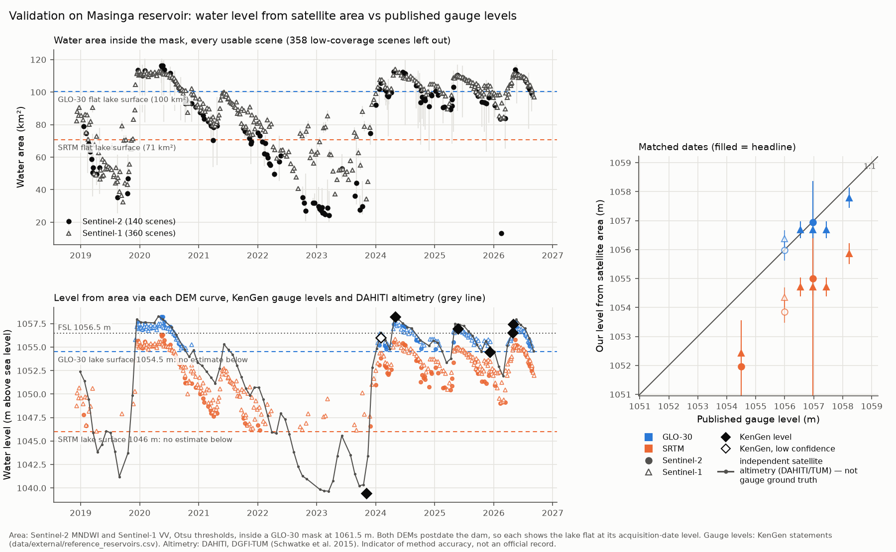

# Validation

How accurate is the method? Thwake has no water yet, so the method is first tested where the answer is known ([ADR 0009](decisions/0009-validation-phase.md)). This page covers the **reference reservoir** (prompt 05a). The hand-labelled shoreline test set (`/05b`) and the `thwake evaluate` accuracy gate (`/05c`) will be added here.

> Satellite levels here are indicators of method accuracy, not an official record of Masinga.

## 1. Reference reservoir: Masinga (Tana River, Kenya)

### Why Masinga

- An existing reservoir 100 km from Thwake, in a similar semi-arid setting, operated by KenGen.
- **Published levels exist:** KenGen gives dated water levels in press releases, and the press quotes them. Eight dated levels were found; six fall in the Sentinel era (Nov 2023 – May 2026) and span ~19 m (1,039.42 – 1,058.22 m). Every figure, with its source URL, date and confidence, is in [`data/external/reference_reservoirs.csv`](../data/external/reference_reservoirs.csv).
- **What is missing:** no published area or storage *series*, and no pre-dam DEM (the dam was finished in 1981, before both DEMs). So this tests **area → level**, the step Phase 2 depends on, not volume.
- Chosen by the author on 2026-10-10 over reproducing a GERD study (GERD's published figures are other satellite estimates or contested statements; it stays a possible later addition, [open question 26](open-questions.md)).
- **Second, denser target: DAHITI satellite altimetry** (DGFI-TUM, target 40216, Sentinel-3B pass 0326; 96 levels, 2018-12-28 → 2026-09-05; Schwatke et al. 2015, *Hydrol. Earth Syst. Sci.* 19, 4345–4364, doi:10.5194/hess-19-4345-2015). It is an **independent satellite altimetry product, not gauge ground truth**: compared in its own block, never mixed into the gauge metrics. Its heights are given as "normal heights"; their datum relation to KenGen's gauge and to the DEMs is not established. The raw download is not committed (terms of reuse unconfirmed); only derived comparisons are.

### What is tested

The same chain Phase 2 will run on Thwake, with parameters fixed in `config/thresholds.yaml` **before** any comparison was run and not changed afterwards:

1. **Max-extent mask:** Copernicus GLO-30 pixels ≤ 1,061.5 m (FSL 1,056.5 m + the 5 m margin used for the Thwake AOI), flood-filled from a seed on the reservoir, behind a closure line burned into the DEM as a barrier (as the Thwake wall, [methodology §1.2](methodology.md)). The closure line is **digitised** on Sentinel-2 (⚠️ verify, [open question 24](open-questions.md)): it follows a road embankment on the north shore, the spillway and the ≈2.1 km main embankment, because GLO-30's 30 m pixels miss the narrow north-shore crest and overflow it at ≈1,055.2 m. With it, no rim pass needs closing up to 1,061.5 m. Mask: **135.4 km²**.
2. **Area–elevation curve** per DEM (GLO-30 2010–14, SRTM Feb 2000) inside that one mask, in 0.5 m steps, built exactly as the Thwake curve ([methodology §1.3](methodology.md)).
3. **Water area** for every Sentinel-2 and Sentinel-1 scene from Dec 2018 to Sep 2026, the DAHITI period ([methodology §2.1–2.2](methodology.md)): Sentinel-2 MNDWI and Sentinel-1 VV (focal median 50 m), each with an Otsu threshold from a histogram over the mask plus a 1 km land ring, falling back to the fixed value (MNDWI 0, VV −18 dB) when Otsu fails or is implausible. Water is counted only inside the mask. Each area has a range: obscured pixels (clouds, no data) count as all dry (low) or all water (high), and shoreline pixels as ± half a pixel. Scenes with less than 70% of the mask visible are flagged `low_coverage` and not compared.
4. **Area → level** on each DEM curve, then compared with each KenGen (and DAHITI) level on the nearest usable scene within 6 days of its date (the gap is reported).
5. **Rapid change:** where the level moves fast, the days between scene and reading alone shift the level. Each comparison carries the fastest level change around its date, from the DAHITI series (consecutive points ~27 days apart); at ≥ 0.04 m/day (≥ 0.24 m over the 6-day window, about half a curve step; set before the DAHITI run) it is flagged `rapid_change`, and metrics are also given without flagged rows.

Run it with `python -m thwake validate reference --name masinga` (Earth Engine, ~35 min and ≈ 42 EECU-hours for the full window, see §5). `--compare-only` recomputes steps 4–5 and the figure from the saved scene areas, without Earth Engine. Each sensor's scene areas are checkpointed during a run, so a failed run resumes without recomputing them.

### The DEMs show the lake, not its bed

Both DEMs were acquired after the dam was built, so each shows the reservoir as a **flat surface at the level of its acquisition date**. Below that surface the curve is flat and no level can be estimated: a measured area at or below the flat area only says "the level was at or below this surface".

| DEM | Acquired | Vertical datum | Flat lake surface | Area of that surface |
|---|---|---|---|---|
| Copernicus GLO-30 (2024_1) | 2010-12-15 – 2014-03-20 | EGM2008 | **1,054.5 m** | 100.3 km² (74% of the mask) |
| SRTM (1″) | 2000-02-11 – 2000-02-22 (drought) | EGM96 | **1,046 m** | 70.7 km² (52% of the mask) |

Which published levels each DEM can show (all eight, including the pre-Sentinel one; none dropped):

| Published date | KenGen level (m) | Confidence | In scene window | GLO-30 (> 1,054.5 m) | SRTM (> 1,046 m) |
|---|---|---|---|---|---|
| 2009-06-26 | 1,035.50 | high | no (context) | no | no |
| 2023-11-06 | 1,039.42 | high | yes | no | no |
| 2024-02-02/05 | ~1,056 | **low** (rounded, "near") | yes | yes | yes |
| 2024-05-02 | 1,058.22 | medium | yes | yes | yes |
| 2025-05-21/28 | 1,056.97 | medium | yes | yes | yes |
| 2025-12-08 | 1,054.49 | medium | yes | **no** (0.01 m below) | yes |
| 2026-04-28 | 1,056.54 | high | yes | yes | yes |
| 2026-04-29 – 05-06 | 1,057.43 | medium | yes | yes | yes |

The measured areas agree with this classification. On 3 Nov 2023 Sentinel-1 measured 34.4 km², below both flat surfaces. On 6 Dec 2025 it measured 98.9 km², just below GLO-30's 100.3 km² and above SRTM's 70.7 km². Source: `convertibility` in [`reference_masinga_metrics.json`](../data/validation/reference_masinga_metrics.json).

### Absolute and relative agreement

- **Absolute** (our level − published level, per date) contains every error: water detection, DEM shape, the time gap between the scene and the reading, *and* any constant offset between KenGen's gauge datum and the DEM's vertical datum (GLO-30 EGM2008, SRTM EGM96; the gauge datum is not stated, [open question 24](open-questions.md)). The mean difference (bias) collects the constant part; the SD around it is the date-to-date scatter (RMSE² = bias² + SD²).
- **Relative** (our change − published change, between consecutive published dates) cancels any constant offset, so a datum or uniform DEM bias cannot hide or create agreement here. What remains is what varies between dates: water-detection errors (cloud edges, wind on radar), DEM shape errors between the two levels, and timing.

Only high- and medium-confidence published levels with a usable, convertible scene enter the metrics. Everything else is listed in the table with its status.

## 2. Results against KenGen (run 2026-10-10, `reference-v1`)

### Scenes

- **Sentinel-2:** 607 days with imagery (Dec 2018 – Sep 2026); 111 had no valid pixel over the mask; of the 496 measured, **140 are usable** (≥ 70% of the mask visible). The rainy seasons are almost entirely cloudy, so Sentinel-2 has no usable scene near three of the six Sentinel-era gauge dates. Otsu thresholds −0.16 to 0.18 MNDWI (median 0.03); the fallback was used 12 times (once on a usable scene).
- **Sentinel-1:** 362 day-and-orbit mosaics (232 ascending, 130 descending), **360 usable**. Otsu thresholds −18.5 to −12.5 dB (median −15.1 dB, warmer than the −18 dB reference from GERD studies); the fallback was never needed.
- Scenes in the Oct 2023 – Jun 2026 overlap reproduce the first run exactly, so the gauge results below are unchanged by extending the window.

### Comparison with KenGen levels

Our level is the level at which the DEM curve reaches the measured area; the range comes from the area range (obscured and shoreline pixels). Differences are ours − KenGen. Full table: [`reference_masinga_comparison.csv`](../data/validation/reference_masinga_comparison.csv).

| Published date | KenGen level (m) | Conf. | Level change (m/day) | Sensor | Scene (gap) | Area km² (range) | GLO-30 level (range) | GLO-30 diff | SRTM level (range) | SRTM diff |
|---|---|---|---|---|---|---|---|---|---|---|
| 2023-11-06 | 1039.42 | high | 0.113 **rapid** | S2 | no usable scene within 6 days | | | | | |
| 2023-11-06 | 1039.42 | high | 0.113 **rapid** | S1 | 2023-11-03 (3 d) | 34.4 (33.2–35.7) | — | not convertible | — | not convertible |
| 2024-02-02/05 | ~1056 | low | 0.062 **rapid** | S2 | 2024-02-02 (0 d) | 105.5 (103.7–107.2) | 1055.97 (1055.62–1056.30) | −0.03 *(low conf.)* | 1053.86 (1053.48–1054.25) | −2.14 *(low conf.)* |
| 2024-02-02/05 | ~1056 | low | 0.062 **rapid** | S1 | 2024-02-07 (2 d) | 107.6 (106.1–109.1) | 1056.37 (1056.10–1056.66) | +0.37 *(low conf.)* | 1054.35 (1054.01–1054.69) | −1.65 *(low conf.)* |
| 2024-05-02 | 1058.22 | medium | 0.001 | S2 | no usable scene within 6 days | | | | | |
| 2024-05-02 | 1058.22 | medium | 0.001 | S1 | 2024-05-01 (1 d) | 114.3 (112.7–115.8) | 1057.79 (1057.43–1058.14) | −0.43 | 1055.86 (1055.51–1056.23) | −2.36 |
| 2025-05-21/28 | 1056.97 | medium | 0.005 | S2 | 2025-05-22 (0 d) | 110.5 (88.6–116.8) | 1056.94 (1054.44–1058.36) | −0.03 | 1055.00 (1050.23–1056.46) | −1.97 |
| 2025-05-21/28 | 1056.97 | medium | 0.005 | S1 | 2025-05-28 (0 d) | 109.2 (107.7–110.6) | 1056.68 (1056.40–1056.97) | −0.29 | 1054.70 (1054.37–1055.03) | −2.27 |
| 2025-12-08 | 1054.49 | medium | 0.023 | S2 | 2025-12-03 (5 d) | 96.8 (81.2–104.1) | — | not convertible | 1051.96 (1048.45–1053.57) | −2.53 |
| 2025-12-08 | 1054.49 | medium | 0.023 | S1 | 2025-12-06 (2 d) | 98.9 (97.6–100.3) | — | not convertible | 1052.43 (1052.14–1052.72) | −2.06 |
| 2026-04-28 | 1056.54 | high | 0.055 **rapid** | S2 | no usable scene within 6 days | | | | | |
| 2026-04-28 | 1056.54 | high | 0.055 **rapid** | S1 | 2026-04-29 (1 d) | 109.2 (107.8–110.6) | 1056.68 (1056.40–1056.97) | +0.14 | 1054.71 (1054.38–1055.03) | −1.83 |
| 2026-04-29 – 05-06 | 1057.43 | medium | 0.055 **rapid** | S2 | no usable scene within 6 days | | | | | |
| 2026-04-29 – 05-06 | 1057.43 | medium | 0.055 **rapid** | S1 | 2026-04-29 (0 d) | 109.2 (107.8–110.6) | 1056.68 (1056.40–1056.97) | −0.75 | 1054.71 (1054.38–1055.03) | −2.72 |

### Headline metrics

High/medium-confidence dates with a usable, convertible scene only (`gauge` in [`reference_masinga_metrics.json`](../data/validation/reference_masinga_metrics.json)):

| Sensor / DEM | n | Bias (m) | RMSE (m) | SD around bias (m) | Max \|diff\| (m) | Changes: n | Changes: RMSE (m) | Without rapid-change rows: n, bias, RMSE |
|---|---|---|---|---|---|---|---|---|
| **Sentinel-1 / GLO-30** | 4 | **−0.33** | **0.46** | 0.32 | 0.75 | 2 | **0.32** | 2, −0.36, 0.37 |
| **Sentinel-1 / SRTM** | 5 | **−2.25** | 2.27 | **0.30** | 2.72 | 3 | **0.19** | 3, −2.23, 2.23 |
| Sentinel-2 / GLO-30 | 1 | −0.03 | 0.03 | — | 0.03 | 0 | — | 1, −0.03, 0.03 |
| Sentinel-2 / SRTM | 2 | −2.25 | 2.27 | 0.28 | 2.53 | 1 | 0.56 | 2, −2.25, 2.27 |

Small samples: n = 1–5 dates. Read these as a first indication, not a calibrated accuracy. Both late-April 2026 readings fall in a rise of 0.055 m/day (DAHITI): without them, Sentinel-1/GLO-30 agrees to 0.37 m RMSE (n = 2).

## 3. Results against DAHITI altimetry (independent satellite product, not ground truth)

`altimetry` in [`reference_masinga_metrics.json`](../data/validation/reference_masinga_metrics.json); rows with `target = altimetry` in the comparison CSV. All 96 DAHITI levels fall in the scene window; **71 are above SRTM's lake surface and 43 above GLO-30's** (the rest are listed as not convertible, none dropped).

| Sensor / DEM | n | Bias (m) | RMSE (m) | SD (m) | Changes: n, RMSE (m) | Rapid-change rows | Without them: n, bias, RMSE |
|---|---|---|---|---|---|---|---|
| **Sentinel-1 / GLO-30** | 32 | **−0.38** | **0.56** | 0.41 | 31, **0.45** | 9 | 23, −0.33, 0.52 |
| Sentinel-1 / SRTM | 67 | −2.30 | 2.43 | 0.76 | 66, 1.05 | 34 | 33, −2.32, 2.42 |
| Sentinel-2 / GLO-30 | 11 | −0.44 | 0.54 | 0.32 | 10, 0.39 | 5 | 6, −0.27, 0.41 |
| Sentinel-2 / SRTM | 29 | −3.16 | 3.25 | 0.77 | 28, 0.83 | 15 | 14, −2.97, 3.08 |

- **The gauge result holds on 8× more dates.** Through GLO-30, Sentinel-1 levels sit 0.38 m below DAHITI with 0.41 m scatter over 32 dates (2019–2026), against −0.33 m and 0.32 m from the four KenGen dates.
- **SRTM's offset is confirmed (−2.3 m with Sentinel-1), but its scatter is larger here** (SD 0.76 m) because DAHITI reaches the lower levels SRTM can still convert (1,046–1,054.5 m). By level, Sentinel-1/SRTM differences are −2.40 ± 0.34 m above 1,054.5 m (n = 43), −2.49 ± 0.69 m at 1,050–1,054.5 m (n = 20) and **−0.37 ± 1.46 m below 1,050 m (n = 4)**: at low levels Sentinel-1 levels jump about 2 m *up* relative to the offset. That is the exposed-bed false water (§4) seen against an independent level.
- **Sentinel-2 vs Sentinel-1 on SRTM:** Sentinel-2's bias is 0.86 m lower (−3.16 vs −2.30 m), on partly different dates. Part of this fits Sentinel-2 measuring ~2.5 km² less water than Sentinel-1 when both see the full lake (§4), which SRTM's curve (~4–5 km² per metre) turns into ~0.6 m.
- **Oct–Dec 2023 (El Niño rise) is flagged throughout.** DAHITI rises from 1,040.35 m (18 Oct) through 1,043.41 m (14 Nov) to 1,052.85 m (11 Dec): 0.11–0.35 m/day. All matches from Sep 2023 to Jan 2024 carry `rapid_change`. Most are below both DEM surfaces anyway (not convertible); the one SRTM match (11 Dec, scene 2 days earlier) gives −1.83 m, within the usual offset.

**DAHITI vs KenGen** (nearest DAHITI point within 6 days of each gauge reading; altimetry − gauge, neither corrected for datum):

| Gauge date | KenGen (m) | DAHITI date (gap) | DAHITI (m) | Difference (m) | Level change (m/day) |
|---|---|---|---|---|---|
| 2024-02-02/05 *(low conf., not in metrics)* | ~1,056 | 2024-02-03 (0 d) | 1,056.53 | +0.53 | 0.062 rapid |
| 2025-05-21/28 | 1,056.97 | 2025-06-03 (6 d) | 1,057.40 | +0.43 | 0.005 |
| 2025-12-08 | 1,054.49 | 2025-12-09 (1 d) | 1,055.00 | +0.51 | 0.023 |
| 2026-04-28 | 1,056.54 | 2026-04-23 (5 d) | 1,056.47 | −0.07 | 0.055 rapid |
| 2026-04-29 – 05-06 | 1,057.43 | 2026-04-23 (6 d) | 1,056.47 | −0.96 | 0.055 rapid |

Over the four headline pairs: bias −0.02 m, RMSE 0.59 m, SD 0.59 m. The two calm pairs agree on DAHITI sitting **~0.5 m above KenGen** (+0.43, +0.51 m), which would be a datum offset between DAHITI's normal heights and the gauge if it holds (two pairs only). The late-April 2026 pairs fall in a fast rise, with DAHITI 5–6 days *before* the readings, so they mostly measure the rise, not the products.

## 4. Discussion

**Sentinel-1 with GLO-30 reproduces KenGen's levels to about half a metre.** Bias −0.33 m, RMSE 0.46 m over four dates spanning 1,056.5–1,058.2 m. In area terms, the GLO-30 curve gains about 5 km² per metre between 1,056 and 1,058 m, so 0.46 m is ≈ 2.2 km² (≈ 2% of the area). The largest miss (−0.75 m) is the 29 Apr – 6 May 2026 reading: KenGen gives no day, and the scene matched is the first day of that interval (29 Apr). Later Sentinel-1 scenes (30 Apr, 3 May) measured 110.1 and 111.1 km², consistent with the rising level reported, but the matching rule (fixed beforehand: inside the interval, then the largest valid share, then the earliest) was not changed after seeing this.

**SRTM is offset by a near-constant −2.25 m, but its shape is right.** The SD around the bias is only 0.30 m, and level *changes* agree to 0.19 m RMSE (n = 3; e.g. May → Dec 2025: KenGen −2.48 m, ours −2.27 m). That is the signature of a constant vertical offset (gauge datum vs EGM96, plus SRTM's own bias), which the relative comparison cancels by design. The SRTM−GLO-30 gap here (~1.9 m) matches the −1.7 m mean SRTM−GLO-30 difference found inside the Thwake max extent ([baseline-v1.md](baseline-v1.md)). Both suggest SRTM sits lower than GLO-30 in this region, and they support GLO-30 as Thwake's primary DEM for absolute levels.

**What the relative comparison adds.** GLO-30's changes also agree (0.32 m RMSE, n = 2), so the date-to-date part of the error is small for both DEMs. What separates them is the constant part, which is mostly datum and DEM bias rather than water detection. For Thwake the same split applies: a constant DEM offset moves every level (and volume, ≈ 30 MCM per metre at FSL) the same way, while detection errors vary by scene. *Disclosure:* in the first run, two consecutive published dates (28 Apr and 29 Apr – 6 May 2026) were matched to the same Sentinel-1 scene, so "our change" was 0 by construction and counted as a −0.89 m error (changes RMSE 0.58 m GLO-30, 0.47 m SRTM). That is a logic error, not a measurement: pairs matched to one scene are now skipped and counted (`skipped_same_scene`). No threshold or parameter was changed.

**Sentinel-1 vs Sentinel-2.** On 79 scene pairs no more than 2 days apart (2019–2026), 61 agree within 10 km², with Sentinel-1 measuring 2.4 ± 3.7 km² (median 3.1%) more water than Sentinel-2. **The 18 large disagreements are almost all at low levels:** in the 25 pairs where Sentinel-2 sees less than SRTM's 70.7 km² flat surface (the 2019, 2022–23 and late-2023 lows), Sentinel-1 measures on average **25.8 km² more** (e.g. 12 Feb 2023, same day: 25.8 vs 78.2 km²), always with a warm Otsu threshold (−12.5 to −14.5 dB). Above that, the 52 agreeing pairs differ by +2.5 km². Two cases in detail:

- **10 Oct 2023, Sentinel-1 88.2 km² vs Sentinel-2 29.6 km² (same day).** The reservoir was near its low (KenGen 1,039.42 m on 6 Nov), with a wide band of exposed reservoir bed inside the mask. Sentinel-1's Otsu threshold was −12.5 dB that day (−13.1 dB on 22 Oct, 79.1 km²), and smooth or dry bare ground has low radar backscatter, like calm water. On 3 Nov Sentinel-1 gives 34.4 km², in line with Sentinel-2. **Sentinel-1 counts exposed bed as water when the reservoir is low** — systematically, as the 2019–2026 pairs and the DAHITI residuals below 1,050 m show (engineering roadmap A8). This matters for Thwake, whose first months of filling will look the same: a small lake inside a large, bare, recently cleared mask.
- **16 Feb 2026, Sentinel-2 13.1 km² (99.97% clear) vs Sentinel-1 83.7 km².** The true-colour image looks normal and Cloud Score+ rates it clear, but the L2A green band over the lake is ≈ 0 (median 0.27 ×10⁻⁴), so MNDWI over water is near −1. Otsu gave −0.53, just outside the plausible range, and the fixed 0 threshold found almost no water. This looks like an atmospheric-correction artefact in that scene, not cloud.

Of the other large pairs, 15 are the low-level pattern above; two (4–5 and 15–16 Nov 2025, Sentinel-1 ≈ 10 km² larger at ~93 km²) were not investigated. None of these scenes is matched to a gauge date, so they do not affect the gauge metrics. Both failure modes would be caught by the Phase 2 QA flags `sensor_disagree` and `jump` ([methodology §2.6](methodology.md)); a guard and an automatic check are planned (engineering roadmap A8–A9, [open question 27](open-questions.md)).

**Side check: area at FSL (low confidence, not a headline).** With the gauge at 1,056.54 m (29 Apr 2026), Sentinel-1 measured 109.2 km² (107.8–110.6). Sentinel-2's nearest usable scene (22 May 2025, 1,056.97 m) gives 110.5 km² (88.6–116.8). The GLO-30 curve gives 108.3 km² at 1,056.5 m and SRTM 114.9 km². The design figure of 120 km² (TARDA via Wikipedia, 1981, unverified) is 8–10% higher than the satellite areas. Possible reasons, none tested: a different survey or shoreline definition, sediment deposition in the inflow arms since 1981 (~13.6% of capacity lost by 2011 per Bunyasi et al. 2013, not opened), and the mask excluding the barrier strip.

**Volume** cannot be tested at Masinga: below each DEM's flat surface the bed is unknown, and no storage series is published.

## 5. Earth Engine cost

| Run step | Wall time | Compute |
|---|---|---|
| Mask, two DEM curves, scene listing (measured, final run) | 3 min | 800 EECU·s (0.22 EECU·h) |
| Scene areas: 607 Sentinel-2 days | 11.5 min | ≈ 155 EECU·s per scene → **≈ 42 EECU·h** for all 969 scenes (estimate) |
| Scene areas: 362 Sentinel-1 day-and-pass mosaics | 18.7 min | (included above) |

The scene areas were computed on 2026-10-10, 01:42–02:13, and reused from checkpoints by the final run (`scenes.<sensor>.reused_from_checkpoint` in `reference_masinga_scenes.json`). Their profiles had expired before the first run summed them, so the per-scene cost was **measured on two sample windows** (Jul–Aug 2019 and Apr–May 2024: 30 scenes, 4,663 EECU·s, no unresolved profiles) and scaled; the code now resolves cost per batch, so the next full run records it directly (`cost` in the same file). Cost scales with the scene count and the mask's bounding box (≈ 1,100 km² here at 10 m); Thwake's mask is ~4× smaller and a monthly update has ~15 scenes. **Rerun the comparison with `--compare-only` (no Earth Engine) unless the scene areas must change.**

## 6. Limits

- **Few gauge dates.** Six Sentinel-era levels from press releases, some with only an approximate date; n = 4–5 per metric for Sentinel-1, 1–2 for Sentinel-2. DAHITI adds 32–67 dates per Sentinel-1 metric, but it is a satellite product with its own errors, not ground truth. A KenGen daily series would make this a proper test ([open question 24](open-questions.md)).
- **Narrow range against the gauge.** Every convertible KenGen date lies within 1,054.5–1,058.2 m (near full). Lower levels are covered only by DAHITI (down to 1,046 m via SRTM) and by the Sentinel-1/Sentinel-2 disagreement.
- **Unknown datums** (open question 24): KenGen's gauge datum and DAHITI's normal heights are not tied to EGM2008/EGM96 here; absolute biases mix datum and DEM error. Relative agreement does not depend on them.
- **Post-dam DEMs.** Masinga tests area → level above each DEM's lake surface only. At Thwake the DEMs predate the dam, so the whole curve is real terrain; but the DEM error found here (SRTM offset) applies there too.
- **Digitised closure line** (open question 24). It only shapes where water may be counted, and it lies along the dam itself.
- **Not yet applied:** speckle removal of isolated specks, slope (radar-shadow) mask, threshold-sensitivity range (prompts 06–07), cloud gap-fill. The area range covers only obscured and shoreline pixels.
- **Indicator, not a record:** these levels show how well the method works; they are not an official record of Masinga.

## 7. Implications for Phase 2 (Thwake)

1. **Use GLO-30 as the primary curve** (confirmed): about 0.5 m level agreement against KenGen and DAHITI, while SRTM was offset by −2.3 m.
2. **Expect Sentinel-1 false water during early filling,** when exposed, cleared ground fills most of the mask (+25.8 km² on average at Masinga's lows). Prompt 06 should test a guard: Sentinel-2 cross-check, VH, a dry-season reference image or change detection, or a stricter threshold range. Any guard must be checked on the labelled set (`/05b`, engineering roadmap A8), not tuned here.
3. **Add a Sentinel-2 QA check for near-zero green reflectance over water** (the 16 Feb 2026 failure; engineering roadmap A9), alongside `sensor_disagree` and `jump`.
5. **Flag comparisons and QA during fast rises:** Masinga rose 9.4 m in 27 days in Nov–Dec 2023; Thwake's first floods may do the same, so time gaps between sensors matter.
4. **Sentinel-1 carries the rainy seasons:** Sentinel-2 had no usable scene near half the gauge dates.

## 8. Possible additions

- **GERD** as a second reference: considered and deferred on 2026-10-10 (pre-dam DEMs exist, but the published figures are other satellite estimates or contested statements).

- **Additional published level:** a government update reported Masinga spilling from **30 Apr 2026** at **0.65 m above FSL (≈1,057.15 m)** ([Eastleigh Voice](https://eastleighvoice.co.ke/garissa%20flooding-garissa%20floods-garissa%20floods%20warning-tana%20river%20flooding-tana%20river%20floods/150780/garissa-tana-river-residents-urged-to-evacuate-as-masinga-dam-exceeds-capacity); TARDA advisory via [Capital FM](https://capitalfm.africa/tarda-issues-flooding-alert-as-masinga-dam-overflows/)). Candidate row for `reference_reservoirs.csv` (medium confidence; falls in a rapid rise) — add with a `--compare-only` rerun.
- **Design capacity is outdated:** Masinga's 1,560 MCM design capacity predates ~30 years of sedimentation (~13.6% lost by 2011, Bunyasi et al., 2013) — another reason it is kept out of the metrics.

### Related work
No published, ongoing satellite **area/volume** monitor specific to Masinga was found (Oct 2026); DAHITI provides altimetry **levels** only. Comparable multi-reservoir efforts elsewhere: the **Mekong Dam Monitor** (Stimson Center; Sentinel-1 primary, Sentinel-2 backup, Earth Engine, DEM-based storage — methods: https://www.stimson.org/2020/mekong-dam-monitor-methods-and-processes/) and the **Reservoir Assessment Tool (RAT)** (University of Washington; storage change, inflow, evaporation, outflow — https://rat-satellitedams.readthedocs.io/). Masinga sedimentation studies: Bunyasi et al. (2013), Maingi (2012), Gichuki et al. (2000).

## 9. Files

| File | Content |
|---|---|
| [`data/external/reference_reservoirs.csv`](../data/external/reference_reservoirs.csv) | Published Masinga figures with source, date and confidence |
| [`config/validation.yaml`](../config/validation.yaml) | Masinga inputs (closure line, seed, window, DAHITI path, label and citation), output paths |
| `data/external/dahiti/…csv` | Raw DAHITI download: **not committed** (git-ignored; terms of reuse unconfirmed). Download from DAHITI (free registration) to rerun the altimetry comparison |
| `data/validation/reference_masinga_mask.geojson` | Max-extent mask (135.4 km² at 1,061.5 m) with provenance |
| `data/validation/reference_masinga_aev.csv` | Area–elevation curves (GLO-30, SRTM), AEV schema; volumes are meaningless below the flat lake surfaces |
| `data/validation/reference_masinga_scenes.csv` (+ `.json`) | Area of every scene (Earth Engine output) and run provenance, including cost |
| `data/validation/reference_masinga_series.csv` | Every scene with its level on each DEM curve |
| `data/validation/reference_masinga_comparison.csv` | KenGen and DAHITI date × sensor × DEM comparison, with level-change rate and `rapid_change` |
| `data/validation/reference_masinga_metrics.json` | Metrics (gauge, altimetry, DAHITI vs KenGen), convertibility, area-at-FSL check, low-confidence list |
| `media/validation_reference.png` | The figure above |
